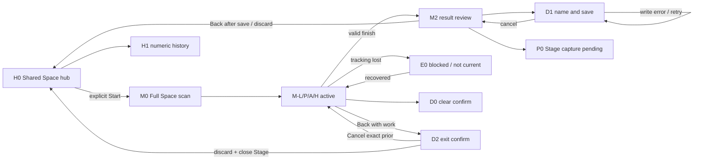

# Interaction / Spatial Design Spec · 实景空间标尺

> Source identity: `spatial-ruler-design-run-4-20260816` | Active revision: **7** | Stage: design_system CR-12A

## 2. Design Principles

| ID | Assertion | Basis | Checkpoint | Precedence |
|---|---|---|---|---|
| P1 | unknown/stale surface evidence fails closed; Undo/Back remain available | PM O1/O3; UXR safety | placement guard and recovery | safety > speed |
| P2 | every active/completed session retains raw meters and per-point provenance; Room history keeps only the frozen numeric record fields | PM O3/O8 | session point schema + bounded Room payload | trust > density |
| P3 | environment stays visually dominant | brief visual requirement | Stage geometry and panel placement | reality > decoration |
| P4 | every destructive exit is reversible until confirmed | PM O5/O7 | transitions/dialogs | recovery > shortcut |
| P5 | history never claims pose restoration | PM O8 | Hub copy/schema | honesty > convenience |

Conflict rule: safety and evidence integrity outrank latency, visual density, and one-step gestures.

## 3. Task / Decision Model

| ID · Task | Actor/context | Input | Decision output | Error consequence | Frequency | Dependencies | Duration |
|---|---|---|---|---|---|---|---|
| T01 Start | user at hub | capability/permission explanation | enter measurement or stay | surprise exclusive space | once/session | none | ≤5s |
| T02 Choose mode/unit | user before commit | line/path/area/height; cm/m/in | active mode/unit | wrong formula/display | 1–few | T01 | ≤3s |
| T03 Surface readiness | user facing target | plane/mesh/freshness/normal | ready/wait/reposition | floating/wrong-plane result | continuous | T01 | ≤1.5s |
| T04 Aim | user points | ray hit + plane extent | accept this candidate as the intended target or reposition | wrong object | per point | T03 | <100ms feedback target |
| T05 Commit point | user pinch/tap | current hit + point provenance | append/block | measurement corrupt | 2–N | T04 | <100ms feedback target |
| T06 Finish | user pinches finish | all committed-point snapshots + mode guard | result/block reason | false precision | once/result | T05 | ≤1s |
| T07 Review result | user in Stage | geometry/raw/unit/trust | accept/undo/new/discard | wrong downstream decision | once/result | T06 | ≤5s |
| T08 Undo/Clear | user with points | point stack/clear intent | undo one/confirm all | data loss | occasional | T05 | ≤2s |
| T09 Name/save | user after result | complete payload + optional screenshot | create/retry/cancel | missing/duplicated record | once/result | T07 | ≤10s |
| T10 Capture | user in active/result | currentSessionId/requestId/origin | keep the returned URI, retry, or dismiss without attachment | privacy or orphan URI | optional | T05/T07 | system-dependent |
| T11 History | user in Shared Space | Room records | select/rename/delete/open screenshot | wrong record action | revisits | T09 | ≤10s |
| T12 Exit/recover | user/system | unsaved/tracking/priorState | resume/discard/return hub | trapped or lost work | any | all | ≤3s |

Dependencies: T01→T02/T03→T04→T05→T06→T07→T09; T08/T10/T12 branch without changing raw facts; T11 is persistent Shared Space revisit.

## 4. Spatial Value Justification · 120-cell ledger

Legend: H/M/L = material/high, supporting/medium, absent/low. Each task records all ten dimensions in order `direction,distance,scale,depth,position,motion,body,collaboration,simulation,time`.

| Task | 10-dimensional judgment | Spatial rationale | 2D counterfactual | Verdict |
|---|---|---|---|---|
| T01 | L,L,L,L,L,L,L,L,L,L | entry is ordinary workflow | 2D start button suffices | Shared Space window |
| T02 | L,L,L,L,L,L,L,L,L,L | choice is symbolic | segmented control suffices | in-window/control panel |
| T03 | H,M,M,H,H,L,M,L,L,H | plane normal/extent/freshness exists in the room; no simulation claim | mobile AR can detect planes and show readiness through a camera view; headset residual value is hands-free continuous inspection in the forward view | Stage justified; advantage provisional |
| T04 | H,H,M,H,H,L,M,L,L,H | ray intersects a real surface while the user observes the target directly | mobile AR can raycast an image pixel to a world surface; headset residual value is direct pointing without holding/alignment of a phone | Stage justified; advantage provisional |
| T05 | H,H,H,H,H,L,M,L,L,H | committed points retain metric/source snapshots | mobile AR can also retain metric points and provenance; headset residual value is body-scale placement with an uninterrupted target view | Stage justified; not unique capability |
| T06 | M,H,H,H,H,L,L,L,L,H | formula uses committed spatial points; no simulation model | mobile AR can calculate the same distance/area/height; headset residual value is immediate result at the observed edge | Stage for co-location; formula parity |
| T07 | M,H,H,H,H,L,L,L,L,H | result remains co-located during direct inspection | mobile AR can overlay results on camera imagery; headset residual value is persistent binocular context without screen framing | Stage + panel; device test required |
| T08 | L,L,L,L,M,M,L,L,L,H | undo/clear is workflow; body gesture is optional | mobile AR/2D buttons fully suffice | buttons authoritative; no Stage value |
| T09 | L,L,L,L,L,L,L,L,L,H | naming/persistence is ordinary form | 2D form fully suffices | ordinary in-window form |
| T10 | M,M,M,M,H,L,L,L,L,H | capture preserves current worn-view context and origin state | mobile AR can capture camera plus overlays too; headset residual value is evidence from the same worn-view session, not a unique function | Stage capture request; parity acknowledged |
| T11 | L,L,L,L,L,L,L,L,L,H | history is numeric/document workflow | 2D list/detail fully suffices | Shared Space hub |
| T12 | M,L,L,M,H,M,L,L,L,H | recovery preserves exact prior spatial state; body input is not required | 2D confirmation can govern the decision equally well | Dialog only for destructive decision |

Competitor opportunity: absorb common mode/unit/history coverage at the need layer, but differentiate through live co-location, fail-closed point provenance, and honest no-pose history. Collaboration is L for v1; Shared Space means coexistence, not multi-user data sync.

Ledger calibration: `simulation=L` for all tasks because v1 measures rather than simulates. `body=M` only where head/hand/body placement affects acquisition; optional palm/wave shortcuts do not raise body value. All residual headset advantages are hypotheses pending direct mobile-AR comparison and PICO device validation.

## 5. Design Hypotheses

| Hypothesis | Information model | Spatial degree | Containers | Path | Primary interaction | Risk/cost |
|---|---|---|---|---|---|---|
| A Reality-edge ledger | point provenance is primary; values annotate real edges | live Mixed Stage measurement | Shared Space Volumetric hub → explicit Full Space Stage Mixed + Planar control | choose→enter→commit→finish→save→return | ray+pinch with button fallback | medium; two-container lifecycle |
| B Surface snapshot workbench | short Stage scan creates bounded plane snapshot; later proxy editing | short spatial capture, then proxy | hub → short Mixed Stage → Volumetric proxy | scan→confirm snapshot→return→edit proxy→save | direct proxy manipulation | high trust burden from aging snapshot |
| C Room survey route | room graph/project first, individual measurements nested | high body/room spatialization | hub → long Mixed Stage survey | scan room→classify surfaces→measure objects→project report | guided walking/scan | highest comfort, mesh, closure cost |

### 5.1 Per-hypothesis T01–T12 coverage

| Hypothesis | T01 | T02 | T03 | T04 | T05 | T06 | T07 | T08 | T09 | T10 | T11 | T12 |
|---|---|---|---|---|---|---|---|---|---|---|---|---|
| A | hub entry | 4 modes/unit | live readiness | live aim | provenance commit | guarded finish | co-located review | undo/clear | create/retry/cancel | capture/retry/dismiss | numeric history | exact-prior recovery/exit |
| B | hub entry | 4 modes/unit | snapshot readiness | proxy aim | snapshot-point commit | guarded finish | proxy review | undo/clear | create/retry/cancel | proxy capture | numeric history | stale/recovery/exit |
| C | project entry | 4 modes/unit | room readiness | guided aim | graph point commit | guarded finish | object review | undo/clear | create/retry/cancel | survey capture | project history | route recovery/exit |

All three concepts cover T01–T12. B's liability is freshness/scale handoff; C's is scan/turning/project scope. Completeness is not equal desirability.

## 6. Concept Selection

Scores are 1–5. Every one of 24 cells has a basis below.

| Hypothesis | Task efficiency | Spatial value | PICO comfort | Domain depth | Safety | Accessibility | Engineering feasibility | Distinctiveness | Total | Verdict |
|---|---:|---:|---:|---:|---:|---:|---:|---:|---:|---|
| A | 5 | 4 | 4 | 5 | 5 | 4 | 3 | 4 | 34 | Selected |
| B | 3 | 3 | 4 | 3 | 3 | 3 | 2 | 4 | 25 | Rejected |
| C | 2 | 5 | 2 | 5 | 3 | 2 | 2 | 4 | 25 | Rejected |

| Hypothesis | Eight cell-level bases in matrix order |
|---|---|
| A | complete T01–T12 shortest loop; T03–T07 residual hands-free/co-location value but mobile-AR parity lowers score to 4; explicit entry/stable exit and ≤10min assumption, with turning/reach pending; point/schema depth O3/O8; fail-closed O1/O3; controller/buttons and seated fallback; SDK legality documented but manager behavior pending E-P6 so feasibility 3; differentiation provisional, not proven uniqueness |
| B | complete ledger but snapshot/proxy handoff adds steps; loses live co-location; shorter Stage may aid comfort; stale timestamp/proxy scale complicate domain/safety; proxy burdens low vision; two unvalidated pipelines lower feasibility; distinctive metaphor remains provisional |
| C | complete ledger but room scan delays quick tasks; richest direction/scale/body; long turning/arm load conflicts with UXR gaps; deep room model exceeds scope; movement/mobility burden; mesh/project closure feasibility low; distinct but adjacent to floor-plan tools |

- **Selected concept**: A, “Reality-edge ledger”.
- **Positioning**: a trustworthy real-surface measurement instrument, not a room-planning dashboard.
- **Evidence refs**: UXR §3A differentiation opportunities, PM O1–O8 and R15, UXR E-P6/platform/safety gaps. Differentiation is a hypothesis because C1–C3 are mobile/adjacent sources and C2 interaction/visual/spatial evidence is incomplete; common coverage is absorbed only at requirement level.
- **Rejections**: B weakens freshness and live spatial reference; C exceeds quick measurement scope and comfort budget.

### 6.1 Comfort and validation boundary

- `deviceValidation.status=not_performed`.
- Comfort, sensing availability, hand input, `<2cm`, `<100ms`, 60fps, manager lifecycle, and engineering-feasibility scores are provisional until device validation/build evidence.
- A limits: no forced camera motion; no room-scan prerequisite; target 2–10 minute sessions; user may reposition instead of sustained torso twisting. Elevated-arm repetition requires controller fallback or a rest/reposition cue.
- System Back always returns to Shared Space directly when clean or through an unsaved-work decision; controller mirrors commit/undo/back and no function is hand-only.
## 7. Experience Architecture

### 7.1 Layer contract

| Layer | Space state / container | Purpose | Entry | Stable exit | Forbidden behavior |
|---|---|---|---|---|---|
| L0 Session hub | Shared Space / `C-HUB` WindowContainer Volumetric | Mode/unit preparation, explicit start, local numeric history, restrained 3D ruler preview | App launch or Stage close | Start measurement, open/close history, app exit | Plane/Mesh/Hand measurement; pretending to restore a saved world pose |
| L1 Measurement world | Full Space / `C-MEASURE` Stage Mixed | Plane/Mesh/Hand acquisition; world-aligned point, line, ticks, area/height geometry | User activates `Start measurement` and grants required permission | Complete, Cancel, system Back, or confirmed discard closes Stage and restores L0 | Automatic Stage entry; trapping Back; moving the user camera |
| L2 Command surface | Full Space / `C-CONTROL` Planar WindowContainer beside Stage | Low-density visible fallback for mode/unit, undo, clear request, screenshot, finish | Created with L1 after Stage is ready | Destroyed before/with Stage close | Becoming a persistent dashboard; obscuring active edge; containing world-space evidence |

`C-HUB` is the requested volumetric default entry, not a substitute for sensing. Its depth is earned by one low-poly, non-interactive ruler token that previews the visual language; preparation and history remain a single readable surface. `C-MEASURE` is a Stage, never nested in Shared Space. Cross-session history stores values and metadata only.

### 7.2 Container selection matrix

| Need | Candidates considered | Selected | Reason / rejection |
|---|---|---|---|
| Default entry/history | Planar; Volumetric; Stage | `C-HUB` Volumetric | Honors the volumetric product entry and provides a restrained 3D preview. Planar is sufficient for reading but would discard the requested volumetric identity; Stage is rejected because preparation/history have low spatial value and cannot be the Shared Space default. |
| World-aligned measurement | Volumetric; Stage Immersive; Stage Mixed | `C-MEASURE` Stage Mixed | Passthrough and real-surface copresence are essential. Volumetric cannot host the RequiredFullSpace sensing path; Immersive hides reality and contradicts the task. |
| Visible command fallback | Stage-world geometry; Planar; Volumetric | `C-CONTROL` Planar | Commands are 2D classification/actions, so a small peripheral Planar surface is most legible. World geometry would mix evidence and commands; Volumetric adds unearned depth. |

## 8. Attachment Decision Record

| Use case | Toolbar | InlineControl | None | Decision and host |
|---|---|---|---|---|
| Mode/unit/undo/clear/screenshot/finish | Rejected: bottom-docked host chrome would add a second horizontal band and cannot guarantee requested lower-right placement | **Selected** inside `C-CONTROL`; 56×56dp minimum targets, two compact rows | Rejected: gesture-only access fails discoverability and controller fallback | InlineControl in `C-CONTROL`; panel remains peripheral and task-scoped |
| Clear all | Rejected: destructive confirmation is not a tool strip | Rejected as final action: inline yes/no can be hit accidentally | Rejected: palm-open cannot directly delete | **Dialog**, hosted by `C-CONTROL`, explicit `Clear all` / `Cancel`; palm only opens it |
| Unsaved exit | Rejected: not a high-frequency tool | Rejected: inline action cannot safely block Stage close | Rejected: would discard or trap work without a decision | **Dialog** in `C-CONTROL`; placement mode In-window modal focus; Cancel is safe default; only Confirm closes Stage |
| Destructive mode change | Rejected: not a persistent tool | Rejected: inline yes/no beside mode choices risks accidental point loss | Rejected: existing points would be cleared without consent | **Dialog** in `C-CONTROL`; placement mode In-window modal focus; Cancel restores exact prior state; Confirm clears only current point stack |
| Record naming and write status | Rejected: not a high-frequency tool strip | **Selected as an ordinary focused form inside the host window**; RecordComposer stays in the normal `C-CONTROL` content flow and owns pending/error/retry/success feedback inline | Rejected: naming and persistence require visible input, validation, and recovery | **None (no attachment)**; D1 is not Dialog, Sheet, popup, or attachment. It is ordinary in-window content replacing the control body for a bounded state. |
| First-use gesture help | Rejected: persistent chrome | **Selected** as one-line in-window static help beside the currently relevant control, no lifecycle state | Rejected only after the one-line help has been seen/dismissed with normal content flow | No attachment/Coachmark; the instruction is ordinary non-core copy and creates no independent runtime component |
| History mode | Rejected: not high-frequency Stage tooling | **Selected** segmented inline switch inside `C-HUB` between Start and History | Rejected: history must be reachable | No TabBar: only two shallow hub views; no Subwindow/Augment |

No `Toolbar`, `TabBar`, `Subwindow`, or `Augment` is approved. A future implementation may not substitute one without re-running Stage 9 because it changes hierarchy and occlusion.

### 8.1 Attachment methodology ledger

| Need | placementMode | selectedType / host | semanticRole | persistence | frequency | InlineControl comparison | None comparison | validationPlan |
|---|---|---|---|---|---|---|---|---|
| mode/unit/undo/clear/capture/finish | In-window | InlineControl / C-CONTROL | task-scoped commands | Stage session | high/medium | selected; keeps action beside status | rejected: gesture-only not discoverable/controller-safe | on-device reach, occlusion and 56dp hit test |
| clear all | In-window modal focus | Dialog / C-CONTROL | destructive confirmation | until choice | rare | rejected: inline yes/no too easy to hit | rejected: palm cannot delete directly | verify Cancel preserves points and Back cancels |
| unsaved exit | In-window modal focus | Dialog / C-CONTROL | block Stage close pending decision | until choice | per unsaved exit | rejected: cannot safely block close | rejected: causes data loss/trap | verify Cancel exact prior and Confirm H0 |
| destructive mode change | In-window modal focus | Dialog / C-CONTROL | protect current point stack | until choice | low | rejected: adjacent confirm risks loss | rejected: silent clear prohibited | verify Cancel exact prior; Confirm target mode/M0 |
| record naming/write | In-window | None attachment; ordinary `RecordComposer` form / C-CONTROL | focused create-record workflow with inline status | D1 state only | once per saved result | selected ordinary inline content: input/actions/status live together; not an attachment | rejected: without the form no naming, validation, retry, or safe cancel | Compact/Regular/Large worst-error fit; positive recordId timing; Cancel/Back preserves M2 |
| first-use gesture help | In-window | ordinary inline copy / current control region | one-line instruction | normal content lifecycle; no independent state | first relevant use | selected; no attachment/component | None allowed after normal flow no longer needs copy | observe comprehension; no Coachmark selector/lifecycle |
| Start/History switch | In-window | InlineControl / C-HUB | shallow route choice | app session | medium | selected; two routes remain in place | rejected: history must stay reachable | Shared Space readability and no-pose comprehension |

## 9. Window and Spatial Sizing

### 9.1 Candidate evaluation

| Container | Candidate A | Candidate B | Candidate C | Selected / basis |
|---|---|---|---|---|
| `C-HUB` Volumetric | 0.56×0.34×0.22m: compact but history line wraps | 0.72×0.44×0.28m: one readable surface plus restrained preview | 0.96×0.58×0.36m: more capacity but dominates Shared Space | **B default**; min=A, max=C, uniform scale only. At 1.75m, default ≈23.2°×14.3° and max ≈30.7°×18.8°, within core 65°×40°. |
| `C-CONTROL` Planar | 560×360dp: compact fallback, content 560×264dp after 96dp title overhead | 720×420dp: two 56dp control rows plus labels and gaps | 960×540dp: easier reading but risks mini-dashboard | **B default**; min=A, max=C. Legal within 320×180–2700×1800dp; fixed depth 640dp; Dynamic worldScale at 1.2–1.5m lower-right. |

### 9.2 Final sizing contract

- `C-HUB`: default/min/max above; one primary window by default; user reposition/resize respected; no non-uniform scaling. Interactive face maps all targets to ≥56dp-equivalent and text to ≥12sp (18sp measurement values).
- `C-CONTROL` calibration chain: the methodology's 1280×720dp Planar 2D baseline was evaluated first. Because this is an auxiliary ≤7-action, two-row peripheral surface rather than a productivity canvas, 1280dp would exceed the task inventory and compete with the measured edge; content/FOV calibration therefore selects 720×420dp default, 560×360dp min and 960×540dp max. These are project decisions, not alternate official baselines.
- `C-CONTROL` rectangle vocabulary (all tiers): `windowBounds` = 560×360 / 720×420 / 960×540dp; subtract fixed 96dp system title to get `hostContent` = 560×264 / 720×324 / 960×444dp; subtract 24dp safe inset on all sides to get `safeContent` = **512×216 / 672×276 / 912×396dp**. Every component size in visual §5 cites `safeContent`, never mixes the three rectangles. Planar depth is 640dp; Dynamic worldScale; nominal 1.2–1.5m lower-right. Core content is approximately 28°×17° and stays under the 85°×55° secondary envelope.
- Reproducible project calibration for `C-CONTROL` (not an official fixed dp→meter rule): target `0.75mm/dp` at the nominal Dynamic worldScale. Min at 1.2m = 0.420×0.270m ≈19.9°×12.8°; default at 1.35m = 0.540×0.315m ≈22.6°×13.3°; max at 1.5m = 0.720×0.405m ≈27.0°×15.4°. Thus all tiers remain peripheral and below the 85°×55° secondary envelope; the earlier ≈28°×17° statement is a rounded outer tolerance, not the sizing basis. If the panel overlaps the active-edge exclusion zone (line bbox + 6° angular margin), it shifts within the lower-right quadrant without becoming head-locked.
- Resize/aspect policy: `C-HUB` is **proportional-only** with uniform 3D scale and a fixed 18:11 front-face ratio; Compact `<0.64m` face width, Regular `0.64–<0.84m`, Large `≥0.84m`, clamped to §9 min/max. `C-CONTROL` permits constrained free resize only within aspect `1.55:1–1.78:1` and min/max bounds. It uses Compact when `safeWidth<640dp OR safeHeight<252dp`; Regular when `safeWidth=640–<840dp AND safeHeight≥252dp`; Large when `safeWidth≥840dp AND safeHeight≥320dp`. An intermediate size uses the highest tier whose width **and** height thresholds both pass; extra space remains padding, while deficits use the lower-tier reflow. Text/targets are never globally scaled.
- `C-MEASURE`: Stage Mixed uses meters and world anchors, not a fixed dp rectangle. Active ruler geometry is limited to the current target surface/edge; labels clamp to a readable offset and never force head-locked motion.
- Density/occlusion ceiling: one value label per active segment focus, one total label, plane grid only within the local hit neighborhood, and no center-screen persistent panel. If the requested lower-right placement collides with the active edge, `C-CONTROL` shifts within the lower-right quadrant; it does not cover the line.

## 10. State Graph

### 10.1 State definitions

| State ID | Container / focus | Layout & core components | Data shown | Entry / exit | Exception / return behavior |
|---|---|---|---|---|---|
| H0 HubReady | `C-HUB`; Start primary | `HubWorkspace` start variant | mode, unit, permission explanation, no-pose history claim | launch/Stage close → start/history/exit | permission not requested until explicit start |
| H1 HubHistory | `C-HUB`; latest record | `HubWorkspace` history variant | name/time/mode/formatted value/screenshot URI state | H0 switch → record action/back H0 | corrupt/missing screenshot shows text receipt, never pose restore |
| H1R HubRename | `C-HUB`; name field | `HubWorkspace` historyRename substate | selected record name/value/time | H1 rename → save/cancel H1 | DB error preserves draft inline; no C-CONTROL created |
| H1D HubDeleteConfirm | `C-HUB`; safe action default | `HubWorkspace` historyDelete substate | selected record name and local-only scope | H1 delete request → confirm/cancel H1 | explicit confirm deletes one local record; no world data or C-CONTROL |
| M0 StageScanning | `C-MEASURE`+`C-CONTROL`; surface focus | `SurfaceReadiness`, `MeasureControlPanel` | plane/mesh readiness, freshness, mode/unit | explicit start + permission → ready M-L/P/A/H | denied/unavailable closes Stage to H0 with reason |
| M-L LineActive | Stage/world; current hit | `SpatialRuler` line variant + controls | 0–2 points, preview segment, live/raw value | M0 ready/line selected → 2 points or pinch M2 | lost → E0; undo removes last point |
| M-P PathActive | Stage/world; current hit | `SpatialRuler` path variant + controls | N points, segments, total | M0 ready/path selected → pinch with ≥2 points M2 | lost → E0; undo removes last vertex |
| M-A AreaActive | Stage/world; current hit | `SpatialRuler` area variant + controls | 0–4 corners, same-plane residual, area | M0 ready/area selected → valid 4th corner M2 | invalid plane/fit blocks completion with reason |
| M-H HeightActive | Stage/world; floor then target | `SpatialRuler` height variant + controls | floor baseline, vertical projection, height | M0 ready/height selected → baseline+target M2 | missing floor blocks first commit; lost → E0 |
| M2 ResultReview | Stage/world; value focus | completed `SpatialRuler` + `MeasureControlPanel.resultReview` | raw meters, chosen unit, trust/freshness | geometry complete → Save/D1, Screenshot, New, Back | unsaved exit → D2; Undo returns active mode |
| E0 TrackingLost | Stage/world; warning focus | dashed frozen geometry + `SurfaceReadiness` | last-known points, `not current`, `recovery.consecutiveFreshFrames`, `recovery.freshDurationMs` | system freshness/track fail → only continuous-fresh guard restores prior state | blocks commits/completion; any unknown/invalid frame resets counters to zero; Cancel exits safely |
| D0 ClearConfirm | Dialog on `C-CONTROL` | `DecisionDialog` clear variant | point count and irreversible scope | palm/button request → confirm active mode / cancel prior | no silent timeout-confirm; Back cancels |
| D1 RecordNaming | ordinary focused in-window form in `C-CONTROL` (not Dialog/Sheet/attachment) | `RecordComposer` inline owns editable name, summary, write status and actions | editable name, numeric summary, screenshot link status, recordWrite state | save from M2 → pending stays D1 → positive-id success observable in D1 → M2; cancel M2 | failure preserves input and offers retry; Back equals Cancel |
| P0 CapturePending | Stage remains visible; capture control disabled | `StatusReceipt` pending | request id, privacy/storage notice, `capture.returnState` | capture request → success `capture.returnState` / failure E1 | does not claim saved until system receipt; origin active state is retained |
| E1 CaptureError | `C-CONTROL`; retry focus | `StatusReceipt` error | actionable reason + `capture.returnState` | system fail → retry P0 / dismiss `capture.returnState` | overlay measurement remains intact |
| D2 ExitConfirm | Dialog on `C-CONTROL`; exact prior retained | `DecisionDialog` discard variant | unsaved result/point count + `exit.priorState` (fallback M0 only if corrupted) | Back/cancel with work → discard H0 / Cancel or system Back restores exact prior | Stage closes only after explicit discard or save |
| D3 ModeChangeConfirm | Dialog on `C-CONTROL` | `DecisionDialog` modeChange variant | `priorState`, requested mode, current point count | mode request with points → confirm target active / cancel exact prior | confirm clears current point stack only; stale surface returns M0 |

### 10.2 Transition contract

| Transition ID | From → To | Trigger / guard | Confirmation | Side effect |
|---|---|---|---|---|
| TR-01 | H0→H1 | `user.openHistory` | none | load local numeric records |
| TR-02 | H1→H0 | `user.backToStart` | none | preserve selected unit |
| TR-03 | H0→M0 | `user.startMeasurement` + permission granted | **explicit start action** | create Stage Mixed then `C-CONTROL`; never auto-enter |
| TR-04 | H0→H0 | permission denied/unavailable | system explanation | no Stage retained |
| TR-05A–D | M0→M-L/P/A/H | plane/mesh fresh + selected mode | none | initialize mode-local point stack |
| TR-06 | active→same active | finger-tap/controller confirm + valid hit | point placement feedback | append raw world point; recompute geometry |
| TR-07 | active→same active | wave/undo button + stack nonempty | none | pop last point only |
| TR-08 | active→M2 | pinch/finish + mode validity | completion feedback | freeze result snapshot; raw meters remain source |
| TR-09 | active/M2→D0 | palm-open or Clear button | Dialog required | no deletion yet |
| TR-10 | D0→active/M2 | Cancel/Back | none | preserve data |
| TR-11 | D0→M0 | explicit `Clear all` | destructive confirm | clear current session geometry only |
| TR-12 | M2→D1 | `ctl-save` / Save | none | open naming, do not save pose |
| TR-13 | D1→D1→M2 | `recordWrite.state=success AND recordWrite.recordId>0` after Room transaction commits | none | persist only name/time/mode/raw meters or raw square meters/unit/screenshot URI and ownership metadata; no points/world pose/provenance in Room; expose success with positive id for one observable render turn (or ≥300ms), then return M2; generic callback success never closes D1 |
| TR-12S | D1→D1 | `user.submitRecord` + valid raw value/name | none | freeze draft; `recordWrite.state=pending`; keep Cancel/Back reachable |
| TR-13E | D1→D1 | `data.recordWriteFailed(reason)` | none | preserve draft; render `RecordComposer.record-write-status=error`; never instantiate StatusReceipt or emit saved |
| TR-13R | D1→D1 | `user.retryRecordWrite` + preserved draft + same `recordWrite.intentId` | none | retry idempotently under Room unique intent key; return pending; an existing positive id resolves as the same success, never a duplicate |
| TR-13C | D1→D1/M2 | Cancel/system Back | none | before submit: return M2 unsaved. While pending: set `cancelRequested=true` and stay D1 until Room reports rollback or commit; rollback→M2 unsaved, late commit with id>0→observable Composer success ≥300ms then M2. Never hide a committed record. |
| TR-14 | active/M2→P0 | Screenshot + media permission | none | store exact origin in `capture.returnState`; capture Stage spatial view with overlays |
| TR-15 | P0→`capture.returnState`/E1 | system capture receipt | none | attach URI then restore `capture.returnState` on success; no false-success or forced completion |
| TR-15B | E1→P0/`capture.returnState` | Retry / Dismiss | none | retry preserves origin; dismiss restores exact active or M2 origin |
| TR-16 | any measurement→E0→exact prior | tracking stale, then `consecutiveFreshFrames>=5 AND freshDurationMs>=250 AND all points freshRevalidate` | none | block commit/Finish and dash last-known geometry in E0; reset both counters on any stale/unknown/anchor mismatch; only the continuous-fresh guard restores exact prior |
| TR-17 | any measurement→H0 | Back/Cancel and no unsaved work | none | close control, close Stage, restore Shared Space hub |
| TR-18 | active/M2→D2 | Back/Cancel with unsaved work | Dialog required | preserve until decision |
| TR-18C | D2→`exit.priorState` | Cancel or system Back | none | restore exact active/M2 state and all points/result |
| TR-19 | D2→H0 | explicit discard | destructive confirm | discard session, close Stage/control, restore hub |
| TR-20 | H1→H1R→H1 | Rename → Save/Cancel | no destructive confirm | edit local name inline; success/error remains in C-HUB |
| TR-21 | H1→H1D→H1 | Delete request → Confirm/Cancel | explicit confirm | delete selected local numeric/screenshot record only |
| TR-22 | active/M2→D3 | mode request + point stack nonempty | Dialog required | store `modeChange.priorState` and `requestedMode`; preserve points |
| TR-23 | D3→`priorState` | Cancel/Back | none | restore exact prior state and points |
| TR-24 | D3→M-L/P/A/H or M0 | explicit Confirm | destructive confirm | clear point stack, set requested mode; enter target active if surface fresh, else M0 |
| TR-25 | M2→M-L/P/A/H or M0 | `ctl-new` / New measurement | none | clear completed result, preserve mode; enter matching active if surface fresh, else M0 |

### 10.3 End-to-end flow



Happy path: H0→M0→mode active→M2→D1→M2→H0. Exception paths preserve a visible recovery: denied permission→H0 explanation; tracking loss→E0→prior; capture failure→E1→retry/dismiss; unsaved Back→D2. All Stage exits restore a navigable `C-HUB` state.

## 11. User Flow Contract

| Flow | Entry | Critical decisions | Completion | Stable return |
|---|---|---|---|---|
| F-LINE | H0 Line + Start | surface ready; point 1/2 valid; result trustworthy | M2 result → optional save/capture | Back/Finish closes Stage → H0 |
| F-PATH | H0 Path + Start | surface ready; ≥2 vertices; pinch finish | M2 total + active segment | same |
| F-AREA | H0 Area + Start | four corners; same-plane + rectangle fit valid | M2 m²/cm²/in² result | same |
| F-HEIGHT | H0 Height + Start | floor baseline found; target hit; vertical projection valid | M2 vertical height | same |
| F-RECOVERY | any active Stage state | undo; clear-confirm; tracking recovery; unsaved exit | returns to prior state or explicit discard | D2 discard closes Stage → H0 |

## 12. Eye–Hand Input Interaction Spec

### 12.1 Common interaction contract

- Every visible interactive element supports indirect **eye focus + pinch**. Gaze alone never commits a point or destructive action.
- World placement uses the hand/controller ray. `preview` is a hollow circle with normal cue; finger tap/pinch or controller select commits only when the hit guard is valid. **Pinch arbitration is focus-first and deterministic**: pinch while the world hit preview owns focus commits a point; pinch while the visible `Finish` control owns gaze/ray focus completes geometry; there is no focus-free completion pinch. If focus changes during pinch-down, the focus captured at pinch-down wins until release.
- Hover: within 60ms target, outline brightens and scales to at most 1.04×; no pulse. Press: 0.96× for 70ms then returns. Disabled elements do not brighten and expose a text reason.
- Controller fallback mirrors the same state transitions: trigger=commit/select, grip/secondary=undo, menu/system Back=return/exit flow. It never creates a controller-only feature.

### 12.2 Gesture / action map

| Intent | Hand/gaze | Controller / panel fallback | Guard | Feedback / recovery |
|---|---|---|---|---|
| Focus command | gaze at ≥56dp target | ray hover | target enabled | 1.04× max + outline; accessible name announced |
| Commit point | hand ray + index tap/pinch while world preview focused | trigger on preview | fresh valid plane hit; mode constraint satisfied; pinch-down focus captured | endpoint pop; raw point appended; invalid keeps hollow preview + reason |
| Finish geometry | gaze/ray focus `Finish` + pinch | trigger on Finish | line=2; path≥2; area=4 valid; height baseline+target | line growth/value settle; invalid announces missing condition; never adds a point |
| Undo | short outward wave OR Undo button | secondary/grip | stack nonempty | last point/segment retracts; button says remaining count |
| Request clear | open palm ≥450ms OR Clear button | trigger on Clear | any session geometry | opens D0 only; no deletion until explicit Dialog action |
| Change mode/unit | gaze+pinch on control | trigger | mode switch with points requests confirmation; unit always safe | recalculates display from raw meters, not previous formatted value |
| Capture | Screenshot control | trigger | media capability/permission | P0 pending then explicit success/error receipt |
| Back/exit | system Back / Back control | system menu/Back | unsaved work → D2; otherwise immediate | destroys C-CONTROL then Stage, restores H0 |

### 12.3 High-risk and error paths

| Risk | Prevention | Confirmation | Recovery |
|---|---|---|---|
| Palm false-positive clears work | 450ms hold + hand shape only opens request | D0 `Clear all` / `Cancel`; focus trapped | Cancel/Back preserves geometry; confirm clears only session |
| Cross-plane area | same-plane residual guard | no override in quick mode | identify offending point; Undo/Reposition |
| Height without floor | floor baseline required | none; operation blocked | `Find floor` guidance or exit |
| Stale tracking | commit/finish disabled | none | E0 text+dashed state; resume only after fresh observation |
| Unsaved exit | D2 before Stage close | `Discard` / `Keep measuring` | save can be entered from M2; cancel returns prior |
| Screenshot save failure | no optimistic success | none | E1 Retry/Dismiss; geometry untouched |

## 13. Motion and Accessibility Spec

| Motion ID | Trigger / purpose | Duration / easing | Spatial range | Reduce Motion | Performance fallback |
|---|---|---|---|---|---|
| MO-01 hit-acquire | valid ray hit; show aim readiness | 90ms ease-out | opacity + 0→8mm ring only | instant hollow ring | static ring at capped update rate |
| MO-02 point-commit | point appended; confirm causality | 140ms spring-like ease-out, no overshoot >1.08× | endpoint 0.7→1.0 scale, ≤2mm | instant filled endpoint + state text | no scale; one-frame fill change |
| MO-03 line-grow | valid segment committed | 180ms cubic-out | along segment only; no camera motion | full line appears immediately | full line immediate |
| MO-04 value-settle | geometry completes; direct attention | 180ms cubic-out | 0.96→1.04→1.0, ≤4mm | immediate value + persistent completed diamond | no scale; completed label only |
| MO-05 undo-retract | last point removed; preserve continuity | 120ms cubic-in | last segment length→0 | immediate removal + count update | immediate removal |
| MO-06 dialog-enter | destructive/exit decision focus | 160ms ease-out | opacity + 8dp→0 inside C-CONTROL | immediate Dialog | no translation |
| MO-07 receipt | async success/error becomes known | 160ms ease-out; holds 2.5s success, error persistent | ≤6dp in R4 | immediate receipt; no auto-motion | static text/icon |
| MO-08 tracking-degrade | freshness threshold crossed | 120ms crossfade | solid→dashed only | immediate dash+warning label | immediate switch |

No camera movement, looping pulse, continuous flicker, ambient drift, or geometry wobble is allowed.

| Accessibility contract | Enabled behavior |
|---|---|
| `reduceMotion` | All MO fallbacks above; meaning persists through fill/dash/shape/text, never motion-only. |
| `controllerFallback` | §12.2 maps every gesture to trigger/grip/menu or visible control with identical state IDs. |
| `colorIndependentSemantics` | ready circle, degraded dashed+triangle, complete diamond, error square+text; cyan/red are redundant. |
| `textScaling` | 1.0–1.5×; C-HUB/C-CONTROL reflow and scroll; world labels cap line length and use leader placement, never shrink below 12sp. |
| `stableExit` | System Back always reaches H0 immediately when clean or through D2 when unsaved; tracking loss does not block exit. |

## 14. Layout Skeleton and Placement Geometry

### 14.1 Derivation evidence

| Relationship | Consequence |
|---|---|
| T01/T04 are low-spatial classification decisions; T12 is temporal reading | They share the readable front face of `C-HUB`; no extra window or spatial orbit. |
| T03→T05→T06 is a tight world-evidence chain | Readiness, hit, and geometry occupy one surface-relative focus; commands cannot sit between eye and edge. |
| Undo/finish/unit are frequent; clear/save/capture are lower frequency or risky | Primary row contains Undo/Finish; secondary row contains Mode/Unit/Clear/Capture; destructive actions open focused Dialog. |
| Raw meters, formatted value, freshness, and geometry are causally linked | The value capsule stays adjacent to the active segment/area centroid/height endpoint; trust never moves to a detached dashboard. |
| Shared Space return and tracking-loss recovery are safety-critical | Back/Cancel remains available on the peripheral command surface; blocking state stays at the last known surface with text+dash, not color alone. |

### 14.2 `C-HUB` skeleton

Primary focus: **Start measurement** in Start view; latest/selected record in History view.

```text
┌──────────────── C-HUB readable face ────────────────┐
│ R1 Brand + explicit “Shared Space” status           │
│ R2 [Start] [History] segmented route                 │
│ R3 Start: mode 2×2 + unit + permission/Stage notice │
│    History: record list + selected metadata          │
│ R4 Primary action / honest no-pose persistence note │
└──────────────────────────────────────────────────────┘
      R5 restrained ruler token extends 0.28m in depth
```

Region ownership: R1 orientation; R2 route; R3 task content; R4 primary action/trust boundary; R5 non-interactive volumetric identity. Density limits: ≤4 mode cards, ≤5 records visible before scroll, ≤1 primary action, ≤1 illustrative 3D token. No central multi-widget dashboard.

Reflow maps to §9 sizes:

- Large 0.96×0.58×0.36m: R3 Start may use 4-column modes; History is list+detail 60/40; R5 uses max depth but stays behind the readable face.
- Default 0.72×0.44×0.28m: Start uses 2×2 modes; History uses list then inline detail; R4 remains visible.
- Compact 0.56×0.34×0.22m: modes become single compact list; History shows one column; selected detail expands in place; R5 scales uniformly and never replaces text.

Rejected: radial mode ring (unnecessary depth and controller burden); separate history window (breaks one-window default); full-width visual dashboard (weakens passthrough-first intent).

### 14.3 `C-MEASURE` world skeleton

Primary focus: the current ray/surface intersection, then the committed geometry.

```text
real surface
  ├─ Z+1mm local readiness grid / hit halo
  ├─ Z+3mm committed line / polygon / vertical projection
  ├─ Z+4mm ticks
  ├─ Z+6mm endpoints
  └─ Z+35mm value + trust capsule, billboarded to viewer

view lower-right, outside active edge
  └─ C-CONTROL (Planar; no world evidence inside)
```

The grid is clipped to a 0.24×0.24m local hit neighborhood with an outer 0.08m fade band; it never floods an entire detected wall. Segment labels use collision priority `active value > total > major tick number`; lower-priority labels hide before overlap. Area keeps one area value at centroid and at most one active-edge length; path keeps total plus active-segment value; height keeps one height value at the upper endpoint. Completed but non-active labels reduce opacity rather than multiply.

Spatial adaptation: no artificial Large/Compact Stage resize. Instead, surface extent is the constraint. If the active edge is within the lower-right command exclusion zone, `C-CONTROL` shifts laterally/upward within the lower-right quadrant. If label projection exits the 65°×40° core zone, it slides along the measured geometry and draws a short leader; it never becomes head-locked.

Rejected: head-locked center reticle/result panel (occlusion and fatigue); persistent full-plane grid (visual noise); multiple floating labels for every segment (V3-like constellation); auto-camera movement (platform/safety conflict).

### 14.4 `C-CONTROL` skeleton

Primary focus: context-dependent **Finish** while geometry is valid, otherwise **Undo**.

```text
┌────────────── 672×276dp safeContent at default ───────┐
│ R1 status: mode · plane readiness · point count      │
│ R2 primary row: [Undo 56] [Finish 56+] [Back 56]    │
│ R3 secondary: mode | cm/m/in | Clear | Screenshot    │
│ R4 receipt or one-line inline help (one at a time)   │
└───────────────────────────────────────────────────────┘
```

R1 owns glance status, R2 high-frequency actions, R3 low-frequency settings/actions, R4 transient receipt or ordinary inline help. 24dp inset, 16dp inter-group gaps, 12dp minimum internal gap, 56×56dp minimum hit targets. Density ceiling: ≤7 actionable targets visible; mode chooser collapses to one menu trigger after Stage entry; only one receipt; inline help has no independent lifecycle.

**D1 deterministic composition**: D1 is an ordinary in-window `RecordComposer`, not Dialog/Sheet/attachment. It exclusively owns name, value, metadata/screenshot, pending/error/retry/success and Cancel. No `StatusReceipt.recordWrite` is instantiated. Worst-error fit: Compact rows 24/56/32/56 + 18 gaps + 16 padding = **202≤216dp**; Regular 36/56/48/56 + 24 gaps + 32 padding = **252≤276dp**; Large 36/56/48/56 + 36 gaps + 40 padding = **272≤396dp**. Error makes the right action Retry while Cancel stays; success requires committed Room transaction plus `recordWrite.recordId>0`, remains observable for ≥300ms/one render turn, then TR-13 returns M2.

Reflow maps to §9 Planar tiers:

- Large 960×540dp: R2/R3 may share one horizontal band; labels remain beside icons; receipt uses dedicated lower band.
- Default 720×420dp: R2 and R3 are two rows; text labels on Finish/Back, icons+accessible names elsewhere.
- Compact 560×360dp: R1 becomes one line; secondary mode/unit open a focused inline popover; Undo/Finish/Back remain visible; screenshot and clear remain in one overflow with 56dp targets. Safety actions are not hidden behind gesture-only access.

Only D0/D2/D3 Dialog replaces R2–R4 temporarily and traps focus until explicit resolution. D1 is ordinary host-window content and never uses modal/Dialog attachment semantics. First-use help is ordinary inline copy and adds no attachment/lifecycle. Rejected: Toolbar docking, floating icon cloud, or extra auxiliary windows.

### 14.5 Composition exceptions

| State | Composition mutation | Preserved facts |
|---|---|---|
| E0 TrackingLost | last geometry switches dashed; readiness message takes value capsule priority; Finish disabled | points remain visible as last-known, controls/exit remain reachable |
| D0/D2 confirmation | command content dims; one Dialog owns focus | world geometry remains visible but cannot accept points |
| P0 capture pending | screenshot disabled; receipt slot shows progress | Stage view remains exactly the content being captured |
| E1 capture error | receipt slot becomes error with Retry/Dismiss | measurement and unsaved state remain intact |
| permission denied | Stage is destroyed/not created; H0 shows inline reason and Settings route | Shared Space hub remains navigable |

## 15. Minimum Completeness Gate (current stage)

| Check Item | Evidence | Verdict |
|---|---|---|
| Principles and tasks | §2 P1–P5; §3 T01–T12, all task fields complete | pass |
| Spatial value and concept | §4 per-task counterfactual; §5 A/B/C; §6 matrix + rejections + market evidence | pass |
| Container and attachment | §7–§8: three containers, explicit Stage contract, attachment comparison | pass |
| Window sizing | §9: 3 candidates/container, default/min/max, viewing basis, density ceiling | pass |
| States and flow | §10: 17 states, 31 authored transition rows / 34 concrete branches after expanding TR-05A–D; happy/exception/return paths | pass |
| Layout composition | §14: task/data/frequency/spatial derivation, one focus, regions, density, Large/Compact/Constrained, rejects | pass |
| Interaction/motion | §12–§13: gaze/pinch, gestures, controller, high-risk recovery, eight bounded motions, five accessibility contracts | pass |
| Implementation spec | §12–§14 plus visual r3 seven-component/tokens/trust facts | pass |

| Field | Value |
|---|---|
| minimumCompletenessGate | pass |

## 16. Delivery and Recipients

- **Current deliverable**: complete interaction/spatial design-system contract revision 7; source identity `spatial-ruler-design-run-4-20260816`.
- **Recipients**: independent design coherence reviewer.
- **Role trace**: Stage 11 `spatial_design_system_designer` CR-12A; §12–§14 active and synchronized with visual r3. No Android/PICO runtime or device evidence is claimed.
